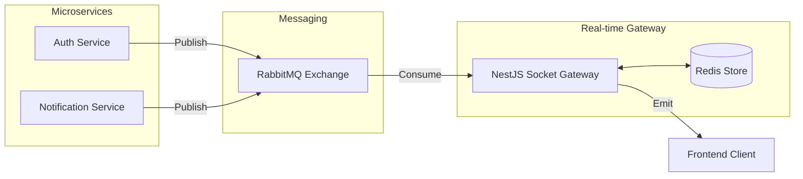

# Advanced Socket.io Strategy: Identity & Multi-Service Integration

This document outlines the backend architecture required to support real-time identity features, such as **Remote Logout (Session Termination)** and **Trusted Device Challenges**, integrated with your existing RabbitMQ and Redis stack.

---

## 1. Identity Mapping (Redis Presence Registry)

To target specific sessions (as requested by the frontend), the Socket Gateway must maintain a high-fidelity mapping in Redis. 

**Recommended Data Structure:**
*   **Key**: `presence:user:{userId}` (Redis Hash)
*   **Field**: `{sessionId}` (Extracted from JWT payload)
*   **Value**: `{socketId}`

### Handshake Lifecycle:
1.  **On Connection**:
    *   Extract `userId` and `sessionId` from the JWT.
    *   Verify session is `active` in PostgreSQL.
    *   `HSET presence:user:{userId} {sessionId} {socketId}`
2.  **On Disconnect**:
    *   `HDEL presence:user:{userId} {sessionId}`

---

## 2. Remote Logout Flow (The Multi-Service Action)

Since the "Logout All" or "Revoke Session" action typically starts in the **Auth Microservice** (REST API), the Socket Gateway must react to those changes via RabbitMQ.

### Execution Path:
1.  **Trigger**: User clicks "Logout All" on the Frontend.
2.  **Auth Service**:
    *   Invalidates all sessions in PostgreSQL.
    *   Publishes a message to the RabbitMQ Topic Exchange:
        *   **Exchange**: `notifications.exchange`
        *   **Routing Key**: `session.termination`
        *   **Payload**: `{ type: 'SESSION_TERMINATED', userId: '...', target: 'ALL' | 'SESSION_ID' }`
3.  **Socket Gateway**:
    *   Listens to the `session.termination` queue.
    *   For the target `userId` or `sessionId`, look up the `socketId` in Redis.
    *   Emits the event: `socket.to(targetSocketId).emit('SESSION_TERMINATED', { reason: 'Remote logout' });`

---

## 3. High-Scale Architecture (RabbitMQ + Redis Adapter)

To ensure this works across multiple NestJS instances, the following is required:

### A. Redis Adapter
Use `@socket.io/redis-adapter` so that an event emitted from Server A can reach a socket connected to Server B.

### B. Event Pipeline

---

## 4. Security & Performance Guardrails

1.  **Global Guards**: Since you already have a global guard to validate tokens/sessions, ensure your `WebSocketGateway` uses a `WebsocketGuard` to prevent unauthorized handshakes.
2.  **Rate Limiting**: Use the Redis store to limit the number of active sockets per `userId` (e.g., max 10 devices online simultaneously) to prevent DDoS.
3.  **Graceful Recovery**: If Redis restarts, the Gateway should rely on the next "Heartbeat" from clients to repopulate the `presence` registry.

---

### Implementation To-Do (Backend Team):
- [ ] Install `@socket.io/redis-adapter`.
- [ ] Implement `SocketGateway` consuming RabbitMQ events.
- [ ] Add `HSET`/`HDEL` logic to `handleConnection` and `handleDisconnect`.
- [ ] Ensure `SESSION_TERMINATED` event name matches the frontend listener.
