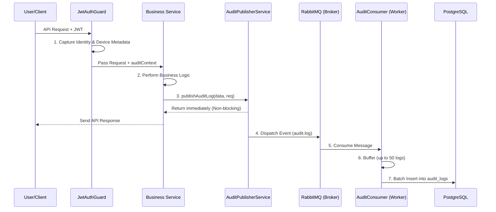

# 🛡️ Enterprise Audit Logging System

This documentation provides a comprehensive overview of the **Audit Logging System** implemented in the backend. It is designed for high-performance, non-blocking operations suitable for enterprise-level applications like ERPs.

---

## 🏗️ Architecture Overview

The system uses an **Asynchronous Event-Driven Architecture** (Option B). This means that auditing never slows down the user's request.

### The Lifecycle of an Audit Log


---

## 🛠️ Key Components

### 1. Metadata Capture (`JwtAuthGuard`)
The guard is the "entry gate". It doesn't just check if you are logged in; it takes a snapshot of your environment:
- **Who**: `userId`, `sessionId`.
- **Where**: `ipAddress`, `userAgent`.
- **What Device**: `browser`, `os`, `deviceType`, `deviceName`.
- **Trace ID**: A unique `requestId` (UUID) is generated. This ID allows you to link a specific API request to its resulting logs across multiple tables or services.

### 2. The Publisher (`AuditPublisherService`)
This is the service junior developers will use most. It is **Global**.
- **Non-Blocking**: It uses RabbitMQ's "fire-and-forget" pattern.
- **Enrichment**: It automatically pulls the metadata from the `Request` object so you don't have to manually pass IP addresses or device names every time.

### 3. The Diff Utility (`AuditDiffUtility`)
Logs are useless if they just say "Record Updated". This utility recursively compares the `old` record and the `new` record to generate a clean list of changes:
```json
[
  { "field": "email", "old": "test@old.com", "new": "test@new.com" }
]
```
> [!TIP]
> It automatically excludes sensitive fields like `password` and system fields like `updatedAt`.

### 4. The Consumer (`AuditConsumer`)
The "heavy lifter" that runs in the background.
- **Batching**: Instead of writing to the DB 1,000 times for 1,000 logs, it waits until it has **50 logs** or **2 seconds** have passed, then performs a single `INSERT` command. This preserves database performance.
- **DLQ (Dead Letter Queue)**: If a log fails to save (e.g., DB is down), the message isn't lost; it goes to `audit.dlq` for later retry.

---

## 🚀 Junior Developer's Guide

### How to add auditing to a new service

1. **Inject the Service**:
```typescript
constructor(private readonly auditPublisher: AuditPublisherService) {}
```

2. **Trigger the Log**:
```typescript
async updateOrder(id: string, dto: UpdateOrderDto, req: Request) {
  const oldOrder = await this.orderRepo.findOne(id);
  
  // ... business logic ...
  
  const newOrder = await this.orderRepo.save({...oldOrder, ...dto});

  // Calculate changes
  const changes = AuditDiffUtility.getChanges(oldOrder, newOrder);

  // Publish (Non-blocking)
  this.auditPublisher.publishAuditLog({
    module: 'Order',
    action: 'UPDATE',
    recordId: id,
    message: `Order #${id} updated by user`,
    changes: changes
  }, req);
}
```

---

## 🔮 Future Architecture: Microservice Migration

If the application grows and the `audit_logs` table becomes too massive for the main DB, we can easily move this to a **Separate Microservice** without changing a single line of business logic:

1. **The Core Backend**: Stays exactly the same. It continues publishing messages to RabbitMQ.
2. **The New Microservice**:
   - Create a new NestJS service.
   - Copy the `AuditLog` entity and `AuditConsumer`.
   - Point the consumer to the same `audit.queue`.
3. **Switch Off**: Remove the `AuditConsumer` from the main backend.

**Result**: Audit logs are now processed and stored in a completely different database and server, but the Backend doesn't even know anything changed!

---

## ⚠️ Common Pitfalls

- **Forgetting the `req` object**: If you don't pass the `Request` object to `publishAuditLog`, the system won't know the IP or Device info of the user. Always pass `@Req() req` from your controller.
- **Sensitive Data**: If you add a new sensitive field (like `creditCardNumber`), make sure to add it to the exclusion list in `AuditDiffUtility.ts`.
- **Large Batches**: If you set the batch size too high (e.g., 5000), you risk losing many logs if the server crashes before a flush. Stick to the default **50**.
